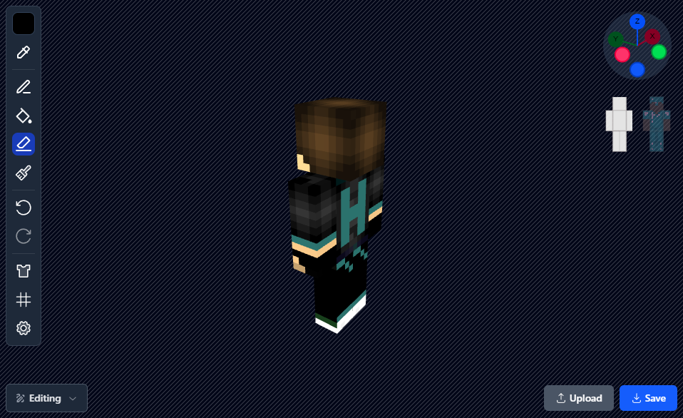

# Mineskin

This is a project for editing and previewing Minecraft skins. The tool has gone through many iterations over the years.

## Technical Information and background

I initially used Three.js to build the website, but later wanted to learn more about 3D graphics and the WebGL API. So I rewrote the project using plain WebGL calls, without any libraries.

## License

This project is licensed under AGPL-3.0. Commercial use is only allowed if your version is also AGPL-compliant and open source. Contact me for alternative licensing.
