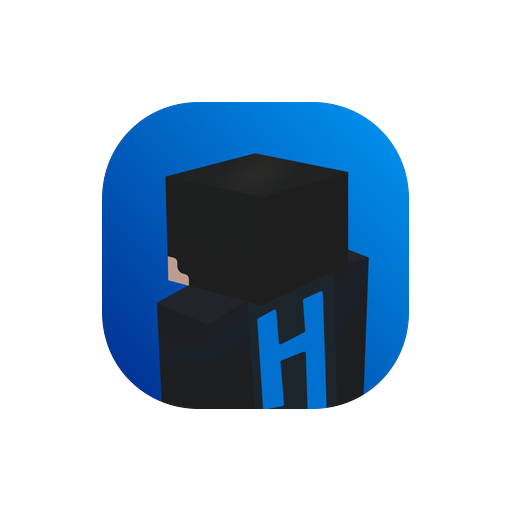
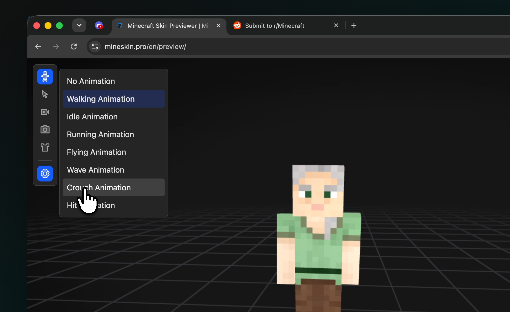

<h1 align="center">
  &nbsp; MineSkin PRO
</h1>

<p align="center">
  A Minecraft skin editor and 3D previewer for the web, iOS, and Android.
</p>

<p align="center">
  <a href="LICENSE"></a>
  <a href="https://github.com/hamza512b/mineskin/issues"></a>
  <a href="CONTRIBUTING.md"></a>
</p>

<p align="center">
  <a href="https://www.mineskin.pro/">Open MineSkin PRO</a> &middot;
  <a href="https://apps.apple.com/app/id6758862638">App Store</a> &middot;
  <a href="https://play.google.com/store/apps/details?id=pro.mineskin.app">Google Play</a> &middot;
  <a href="USAGE_GUIDE.md">Usage guide</a> &middot;
  <a href="https://github.com/hamza512b/mineskin/issues/new/choose">Report an issue</a>
</p>

<p align="center">
  <a href="demo.mp4">
    
  </a>
</p>

MineSkin PRO lets you upload, preview, and edit Minecraft skins from every
angle. It supports pixel painting, shading, erasing, symmetry, multiple brush
shapes, part and layer visibility, animations, screenshots, and clip recording.
Work is previewed immediately in a custom WebGL renderer.

## Getting started

### Prerequisites

- [Node.js](https://nodejs.org/) 20 or newer
- npm

### Run locally

```bash
git clone https://github.com/hamza512b/mineskin.git
cd mineskin
npm ci
npm run dev
```

Open [http://localhost:3000](http://localhost:3000). The app automatically uses
a locale-prefixed route such as `/en/`.

### Build

```bash
npm run build
```

MineSkin PRO is a Next.js application. Capacitor packages the static export for
the native iOS and Android apps:

```bash
npm run cap:build
```

Opening Xcode or Android Studio and publishing store builds requires additional
platform credentials. Release commands are maintainer-only operations and are
not part of the normal contribution workflow.

## Architecture

- `src/core` contains the custom WebGL renderer, skin model, tools, input, undo,
  and recording code.
- `src/store` contains the Zustand store and persisted configuration.
- `src/widgets` and `src/components` contain product UI and reusable controls.
- `src/app` contains locale-prefixed Next.js routes.
- `src/i18n` contains dictionaries and translation glossaries.
- `ios` and `android` contain the Capacitor native projects.

The renderer uses the WebGL API directly rather than Three.js. See
[AGENTS.md](AGENTS.md) for the repository invariants that also apply to human
and automated contributors.

## Contributing

Contributions are welcome. Start with the [Contributing Guide](CONTRIBUTING.md),
search [existing issues](https://github.com/hamza512b/mineskin/issues), and use
the [issue chooser](https://github.com/hamza512b/mineskin/issues/new/choose) for
bug reports or feature requests.

By submitting a pull request, you agree to the [Contributor License
Agreement](CLA.md). Please also follow the [Code of Conduct](CODE_OF_CONDUCT.md).

## Support and security

- For usage help, see [SUPPORT.md](SUPPORT.md) or join the
  [Discord server](https://discord.gg/2egvhmqdza).
- For vulnerabilities, follow the private reporting process in
  [SECURITY.md](SECURITY.md). Do not open a public issue.

## License

MineSkin PRO is licensed under the [GNU Affero General Public License
v3.0](LICENSE). The project owner also offers separate commercial licensing.
Contributions are accepted under the [CLA](CLA.md), which permits the project
owner to continue offering both AGPL and commercial builds.
